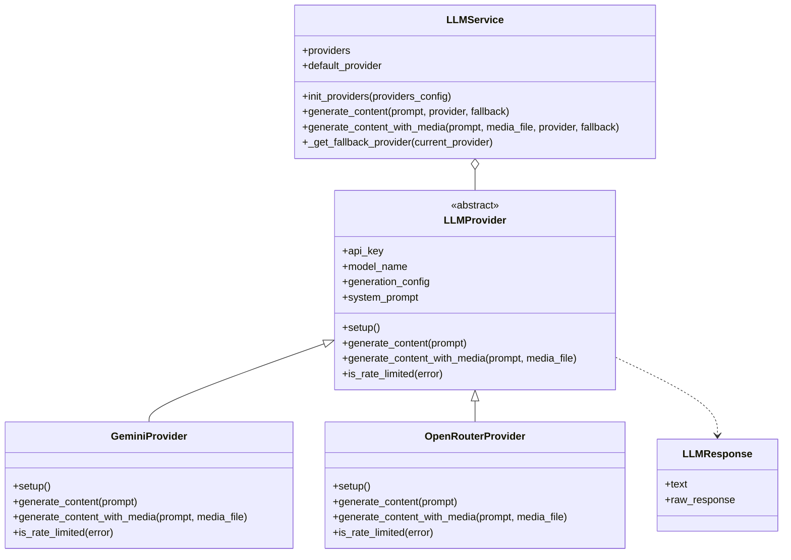

# Plan for LLM Provider Abstraction to Handle Rate Limits

I'll help you create an abstraction layer for your LLM usage to address the Google Cloud API rate limit issues by enabling switching between different providers like Google Gemini and OpenRouter.

## Current System Analysis

After reviewing your codebase, I can see:

1. You're using Google's Gemini API directly in `genai_helper.py`
2. Several functions in `genai_helper.py` rely on Gemini for various tasks:
   - Summarizing YouTube videos
   - Processing text content
   - Analyzing audio files (MP3)
   - Generating slugs and tags
3. Your application processes content from multiple sources:
   - YouTube videos
   - RSS feeds
   - Podcast feeds
4. The rate limits are causing issues with your workflow

## Requirements Clarification

You need:
- A mixed approach where there's a primary provider with fallbacks
- The ability to override the provider for specific functions
- Initial support for Google Gemini and OpenRouter

## Proposed Architecture



## Implementation Plan

1. **Create Provider Abstraction Layer (`llm_provider.py`)**
   - Abstract base LLM provider class
   - Concrete implementations for Gemini and OpenRouter
   - Service class to manage providers and handle fallbacks
   - Standardized response format

2. **Refactor `genai_helper.py`**
   - Replace direct Gemini usage with the new abstraction
   - Maintain backward compatibility (same function signatures)
   - Add optional provider parameter to all functions
   - Implement appropriate fallback logic

3. **Update Configuration**
   - Add environment variables for OpenRouter
   - Configure default provider and fallback options

4. **Update Requirements**
   - Add OpenRouter SDK dependency

## Detailed Implementation Approach

### 1. Create `llm_provider.py`

This file will contain:
- `LLMProvider` - Abstract base class defining the interface
- `GeminiProvider` - Implementation for Google Gemini
- `OpenRouterProvider` - Implementation for OpenRouter
- `LLMService` - Service to manage providers and handle fallbacks
- `LLMResponse` - Standardized response object

### 2. Refactor `genai_helper.py`

We'll:
- Initialize the `LLMService` with both providers
- Replace direct Gemini calls with the service
- Add provider parameter to all functions with fallback capability
- Handle rate limit detection and provider switching

### 3. Configuration Changes

Add to `.env`:
```
# Google Gemini
GEMINI_API_KEY=your_gemini_api_key
GEMINI_MODEL=gemini-2.5-pro-exp-03-25

# OpenRouter
OPENROUTER_API_KEY=your_openrouter_api_key
OPENROUTER_MODEL=anthropic/claude-3-opus

# LLM Service Configuration
DEFAULT_LLM_PROVIDER=gemini  # or openrouter
```

### 4. Requirements Update

Add to `requirements.txt`:
```
openai  # Used for OpenRouter API
```

## Key Features of the Implementation

1. **Seamless Fallback**: Automatically detects rate limit errors and switches providers
2. **Provider Overrides**: Allows specifying the provider for individual function calls
3. **Compatibility**: Maintains the same interface for backward compatibility
4. **Media Handling**: Manages the different capabilities between providers for media processing
5. **Error Detection**: Specifically identifies rate limit errors for intelligent fallbacks

## Implementation Steps

1. Create the `llm_provider.py` file
2. Implement the abstract provider interface
3. Create concrete provider implementations
4. Build the service layer to manage providers
5. Update `genai_helper.py` to use the new abstraction
6. Add configuration options and environment variables
7. Test each provider implementation
8. Verify fallback behavior

## Potential Challenges

1. **Handling Different Response Formats**: Each provider might return results in different formats
2. **Media Support Differences**: Not all LLM providers support the same media types or formats
3. **Rate Limit Detection**: Different providers have different ways of indicating rate limits
4. **Authentication**: Managing API keys and authentication for each provider
5. **Cost Management**: Tracking usage across providers to manage costs

## Next Steps

After implementing this architecture, potential future improvements could include:
- Adding more LLM providers like Anthropic, Cohere, etc.
- Implementing a cost-based routing strategy
- Adding caching layer to reduce API calls
- Implementing quality-based provider selection